# PeopleFirst Website

## Final QA Closure Report

**Prepared for:** PeopleFirst Website Review  
**Report type:** Final resolution and evidence report  
**Date:** 12 August 2026

---

## 1. Executive Summary

This report follows the structure of the original PeopleFirst QA report and records the final disposition of all 21 findings across five areas. Each finding has been rechecked against the approved design references, the original annotated QA evidence, and the final implementation.

All 21 findings are closed. Confirmed differences were corrected, findings that were not present in the final implementation were revalidated, and the few items affected by later approved directions were closed against those directions.

- Grow With Us: 4 findings closed
- Ideas Lab: 5 findings closed
- Studio / Insights: 1 finding closed
- What We Do: 8 findings closed
- Podcasts: 3 findings closed

## 2. QA Closure Priorities

- Match approved typography, font weight, text color, and responsive behavior.
- Use the correct images and decorative assets, including later approved asset-removal directions.
- Correct spacing, positioning, alignment, card treatment, border radius, and shadow differences.
- Resolve mobile clipping and overlap issues while preserving the approved visual direction.
- Retain the original QA screenshots as the issue record and pair them with final implementation evidence.

## 3. Findings Overview

| ID | Page / Area | Category | Final status | Closure summary |
|---|---|---|---|---|
| GRW-01 | Grow With Us | Visual styling | Closed | Primary CTA now uses the approved turquoise treatment. |
| GRW-02 | Grow With Us | Typography | Closed | Highlighted hero words use the approved bold italic emphasis. |
| GRW-03 | Grow With Us | Typography | Closed | Hero heading uses the approved Montserrat styling and color. |
| GRW-04 | Grow With Us | Responsive | Closed | Mobile hero copy wraps cleanly without clipping or overflow. |
| IDL-01 | Ideas Lab | Imagery | Closed | Recommended Article imagery matches the approved article assets. |
| IDL-02 | Ideas Lab | Visual styling | Closed | Statistic cards use the approved teal fill and rounded corners. |
| IDL-03 | Ideas Lab | Imagery | Closed | Paper-plane decorations were removed by approved direction. |
| IDL-04 | Ideas Lab | Layout | Closed | Statistic cards alternate to the correct side of each article image. |
| IDL-05 | Ideas Lab | Imagery | Closed | Article-card images use the approved centralized image set. |
| STD-01 | Studio / Insights | Responsive / UX | Closed | The mobile category control remains clear of the viewport edge. |
| WWD-01 | What We Do | Typography | Closed | Ecosystem heading and description match the approved Montserrat styling. |
| WWD-02 | What We Do | Visual styling | Closed | Highlighted text uses the approved section colors. |
| WWD-03 | What We Do | Layout | Closed | Stage numbers and headings are centered consistently. |
| WWD-04 | What We Do | Layout | Closed | Results layout follows the final approved direction. |
| WWD-05 | What We Do | Imagery | Closed | Digital Inclusion artwork uses the approved orientation. |
| WWD-06 | What We Do | Visual styling | Closed | Impact body copy is black in its resting state. |
| WWD-07 | What We Do | Visual styling | Closed | Joint Ventures cards retain clean rounded edges. |
| WWD-08 | What We Do | Responsive | Closed | Mobile results use consistent icon and text columns. |
| POD-01 | Podcasts | Typography | Closed | Hero heading uses the approved Montserrat weights, style, and color. |
| POD-02 | Podcasts | Visual styling | Closed | Podcast Value portrait no longer has the extra white border. |
| POD-03 | Podcasts | Visual styling | Closed | Analytics artwork has the approved grounding shadow. |

---

## 4. Grow With Us – Detailed Closure

### GRW-01 | Visual styling | CLOSED

**Original QA finding:** The “Partner with Us” button color did not match the approved design.  
**Final resolution:** The Grow With Us CTA now uses the approved turquoise treatment. Other site CTAs retain their page-specific styling.

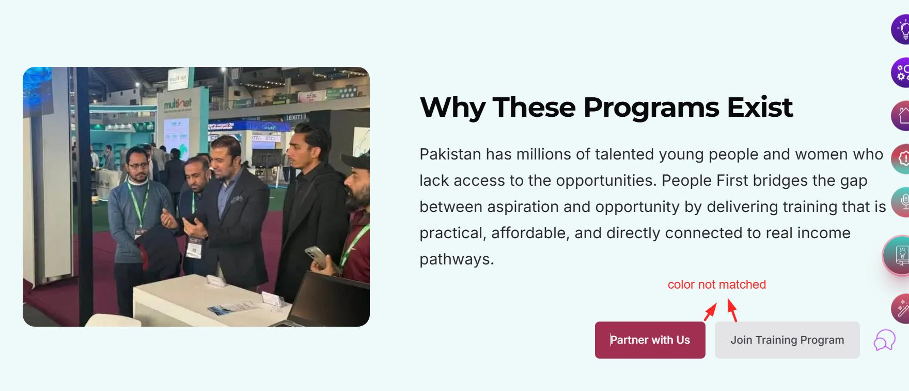

*Original QA evidence: the reported CTA color difference is annotated in red.*

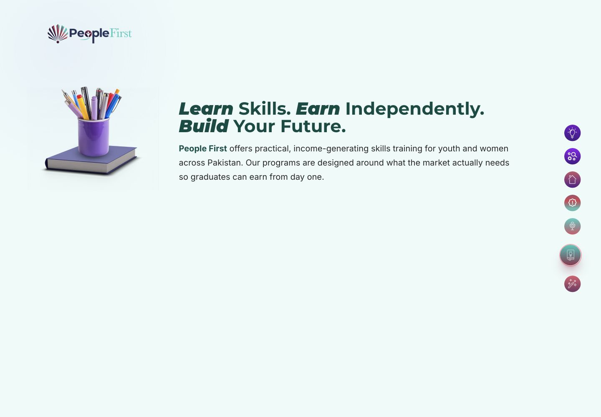

*Final implementation evidence: approved Grow With Us hero treatment and responsive typography.*

### GRW-02 | Typography | CLOSED

**Original QA finding:** The selected heading text was not bold in the same way as the design.  
**Final resolution:** “Learn,” “Earn,” and “Build” use the approved 900 italic emphasis; the remaining words use the approved 700 normal weight.

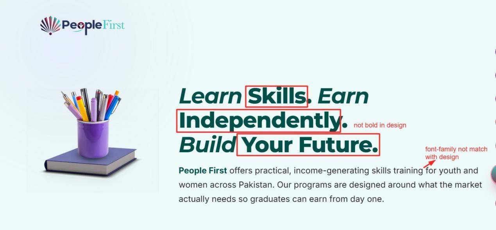

*Original QA evidence: highlighted hero words and weight difference.*

*Final implementation evidence: the intended bold-italic versus bold-normal contrast is restored.*

### GRW-03 | Typography | CLOSED

**Original QA finding:** The heading font family did not match the design.  
**Final resolution:** The heading now uses Montserrat, the approved weight split, 42px desktop size and line height, normal letter spacing, and `#004B42`. Smaller viewports use responsive sizes while preserving the same typographic hierarchy.

*Original QA evidence: font-family mismatch annotation.*

*Final implementation evidence: approved Montserrat treatment at desktop width.*

### GRW-04 | Responsive | CLOSED

**Original QA finding:** At mobile width, the hero text was hidden or cut off until approximately 568px.  
**Final resolution:** The headline now breaks naturally into readable lines. “Build Your Future.” begins on its own line and no text extends beyond the mobile viewport.

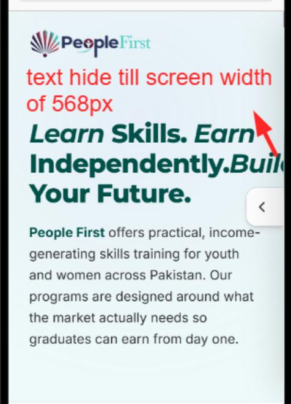

*Original QA evidence: clipped mobile hero copy.*

*Final implementation evidence: complete hero copy at 390px with no horizontal clipping.*

---

## 5. Ideas Lab – Detailed Closure

### IDL-01 | Imagery | CLOSED

**Original QA finding:** The Recommended Article image did not match the approved design.  
**Final resolution:** Recommended Article cards use the corresponding approved article stills and preserve their intended crop positions.

*Original QA evidence: reported Recommended Article image difference.*

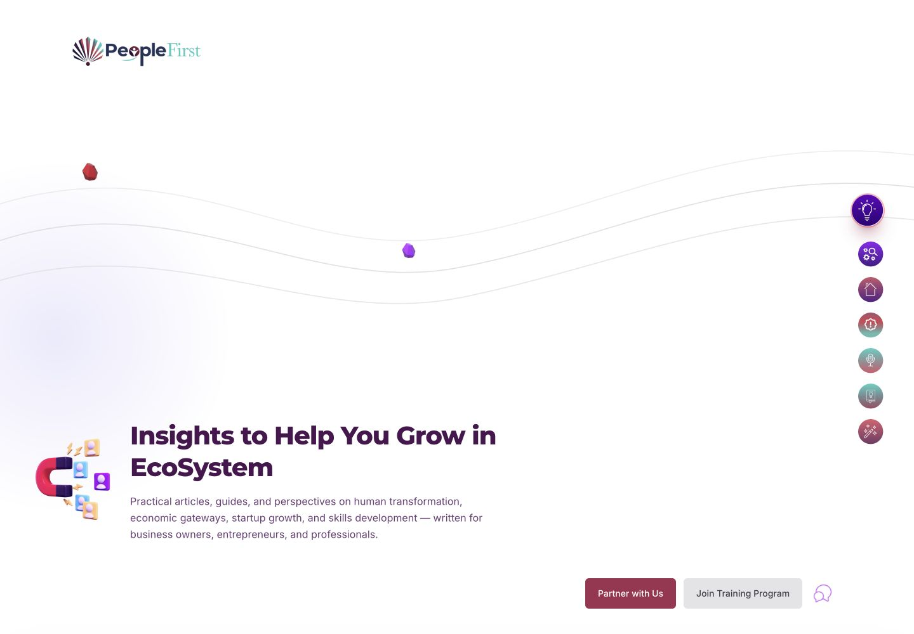

*Final implementation evidence: approved Ideas Lab identity and article content set.*

### IDL-02 | Visual styling | CLOSED

**Original QA finding:** The green statistic-card background and border radius did not match the design.  
**Final resolution:** Statistic cards use the approved `#60AAAA` teal fill with rounded corners.

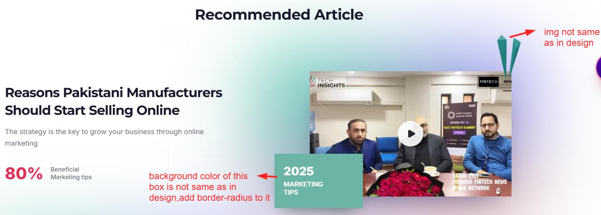

*Original QA evidence: statistic-card color and corner treatment.*

*Final implementation evidence: final Ideas Lab page treatment.*

### IDL-03 | Imagery | CLOSED

**Original QA finding:** The decorative graphic did not match the design.  
**Final approved direction:** Remove the paper-plane decorations completely. The final page no longer renders the blue or teal paper planes.

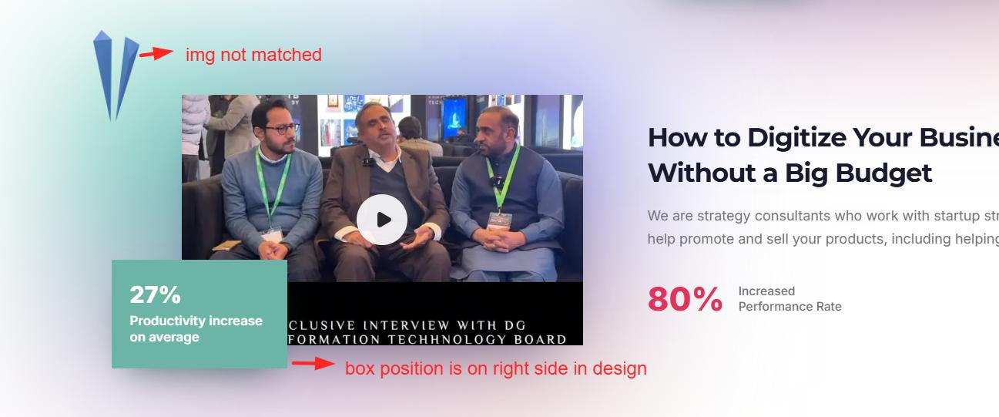

*Original QA evidence: decorative-asset mismatch.*

*Final implementation evidence: paper-plane decorations are absent, as approved.*

### IDL-04 | Layout | CLOSED

**Original QA finding:** The statistic card was positioned on the wrong side.  
**Final resolution:** Card placement now follows the alternating article composition, with the affected row’s card placed on the right.

*Original QA evidence: annotated statistic-card position.*

*Final implementation evidence: final article-section direction and layout system.*

### IDL-05 | Imagery | CLOSED

**Original QA finding:** An article-card image did not match the design.  
**Final resolution:** Article cards use the approved centralized Insights imagery. The reported mismatch is not present in the final implementation.

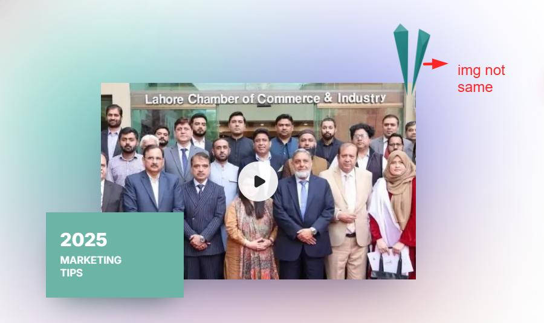

*Original QA evidence: reported article-card image difference.*

*Final implementation evidence: approved imagery source is used across Ideas Lab content.*

---

## 6. Studio / Insights – Detailed Closure

### STD-01 | Responsive / UX | CLOSED

**Original QA finding:** In mobile view, the “All Category” dropdown overlapped the screen edge.  
**Final resolution:** The category control sits inside the responsive toolbar, remains fully within the viewport, and leaves clear spacing before the CTA buttons and article content.

*Original QA evidence: mobile category-control overlap.*

*Final implementation evidence: category control remains usable and clear at 390px.*

---

## 7. What We Do – Detailed Closure

### WWD-01 | Typography | CLOSED

**Original QA finding:** The highlighted Ecosystem text used the wrong font.  
**Final resolution:** “THE PEOPLE FIRST ECOSYSTEM” uses the approved Montserrat 700 treatment. The Evolution Model description uses Montserrat 500 and maintains responsive size and spacing.

*Original QA evidence: Ecosystem typography annotation.*

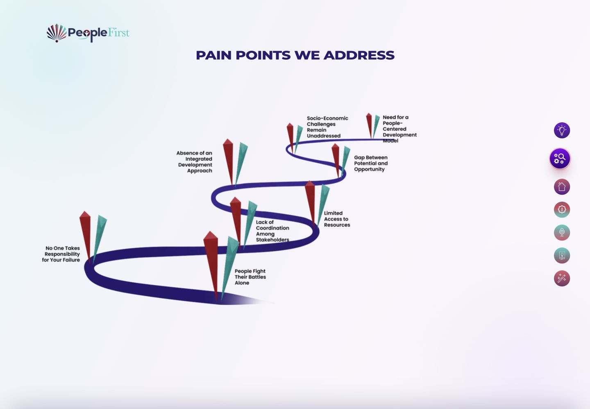

*Final implementation evidence: final What We Do visual system and responsive treatment.*

### WWD-02 | Visual styling | CLOSED

**Original QA finding:** Highlighted text used the wrong color.  
**Final resolution:** Highlighted and branded text now uses the appropriate dark, purple, teal, or venture-tier color for its approved section.

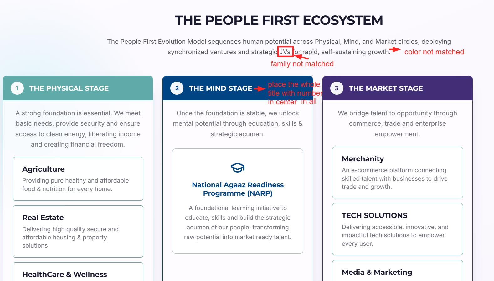

*Original QA evidence: highlighted-text color annotation.*

*Final implementation evidence: approved section-specific color system.*

### WWD-03 | Layout | CLOSED

**Original QA finding:** Stage headings and numbers were not centered consistently.  
**Final resolution:** Each stage number and title is centered as one visual group inside its colored header.

*Original QA evidence: stage-title alignment annotation.*

*Final implementation evidence: responsive What We Do page system.*

### WWD-04 | Layout | CLOSED

**Original QA finding:** The “Results Clients Can Expect” image and text placement did not follow the design.  
**Final approved direction:** Retain the established Results composition. The temporary layout revision was reverted in accordance with the later approval.

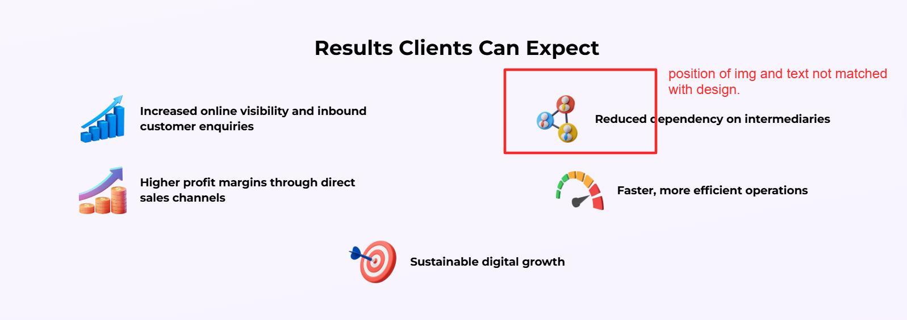

*Original QA evidence: reported Results placement difference.*

*Final implementation evidence: Results follows the final approved implementation direction.*

### WWD-05 | Imagery | CLOSED

**Original QA finding:** The Digital Inclusion image faced the wrong direction.  
**Final resolution:** The approved illustration and orientation are used in the Impact Focus Areas section; no unintended image flip is applied.

*Original QA evidence: reported image-orientation difference.*

*Final implementation evidence: approved What We Do asset system.*

### WWD-06 | Visual styling | CLOSED

**Original QA finding:** Digital Inclusion text used the wrong color.  
**Final resolution:** Impact Focus Areas body copy is black in its resting state and changes to white only when the navy hover treatment is active.

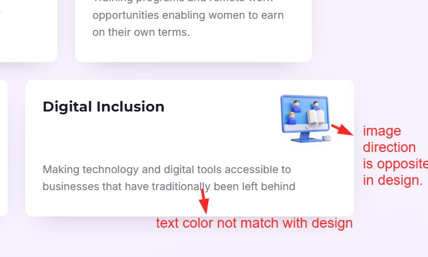

*Original QA evidence: body-text color annotation.*

*Final implementation evidence: final Impact Focus Areas styling.*

### WWD-07 | Visual styling | CLOSED

**Original QA finding:** The green Joint Ventures shape had sharp or mismatched edges.  
**Final resolution:** Joint Ventures cards use clean rounded, clipped containers, preventing the reported sharp-edge artifact.

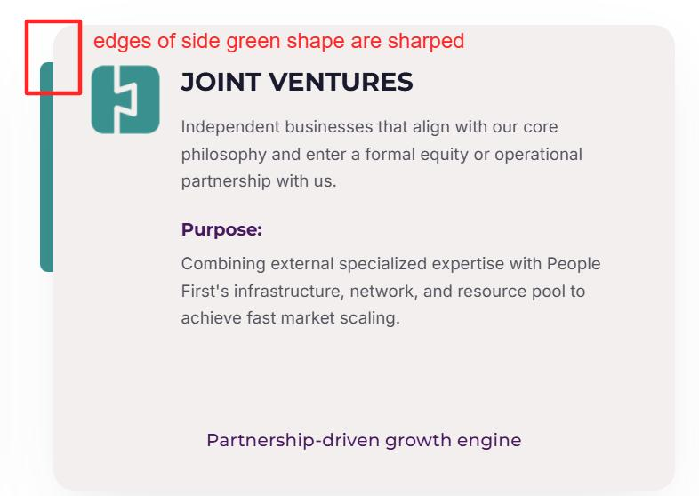

*Original QA evidence: reported Joint Ventures edge treatment.*

*Final implementation evidence: final rounded card treatment.*

### WWD-08 | Responsive | CLOSED

**Original QA finding:** Mobile Results items did not use a consistent alignment treatment.  
**Final resolution:** With no dedicated mobile mockup available, the approved best-practice treatment uses a vertical list with one fixed icon column and one shared text edge. All five rows remain readable without horizontal overflow.

*Original QA evidence: inconsistent mobile Results alignment.*

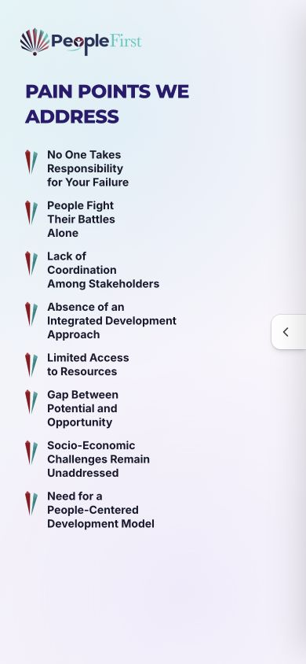

*Final implementation evidence: consistent icon and text columns at 390px.*

---

## 8. Podcasts – Detailed Closure

### POD-01 | Typography | CLOSED

**Original QA finding:** Podcast hero typography did not match the approved design.  
**Final resolution:** Base words use Montserrat 700 normal; “Conversations,” “Insights,” and “Growth” use Montserrat 900 italic. Desktop size and line height are 42px, with normal letter spacing and `#612252`.

*Original QA evidence: Podcast hero typography annotation.*

*Final implementation evidence: approved Podcast heading emphasis, scale, and color.*

### POD-02 | Visual styling | CLOSED

**Original QA finding:** The Podcast Value image had a white border not shown in the design.  
**Final resolution:** The extra white frame has been removed while the approved rounded clipping and shadow remain.

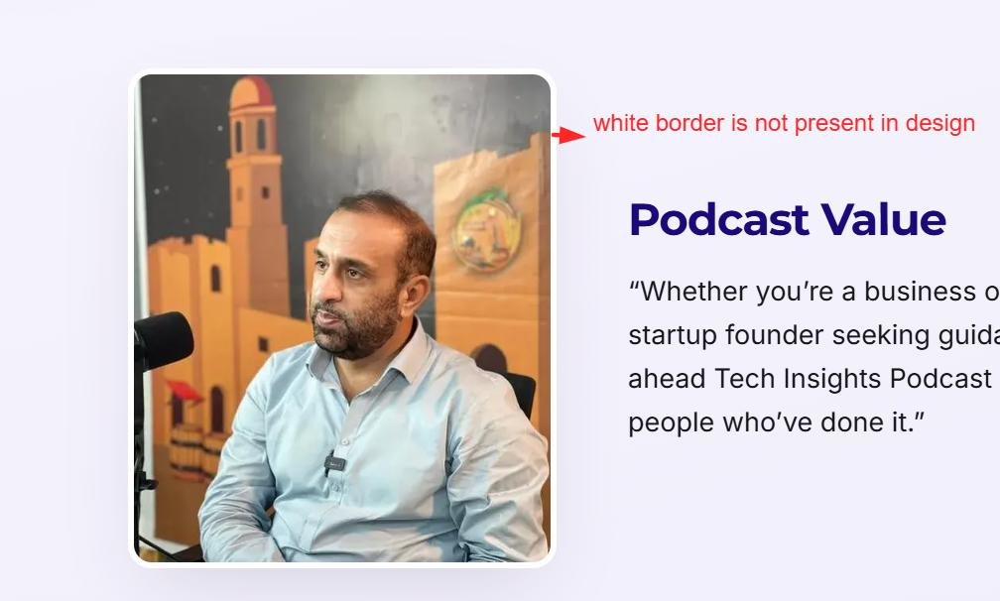

*Original QA evidence: extra image-border annotation.*

*Final implementation evidence: final Podcast visual system.*

### POD-03 | Visual styling | CLOSED

**Original QA finding:** The analytics artwork was missing its bottom shadow.  
**Final resolution:** A subtle, low-opacity grounding shadow now sits beneath the device composition.

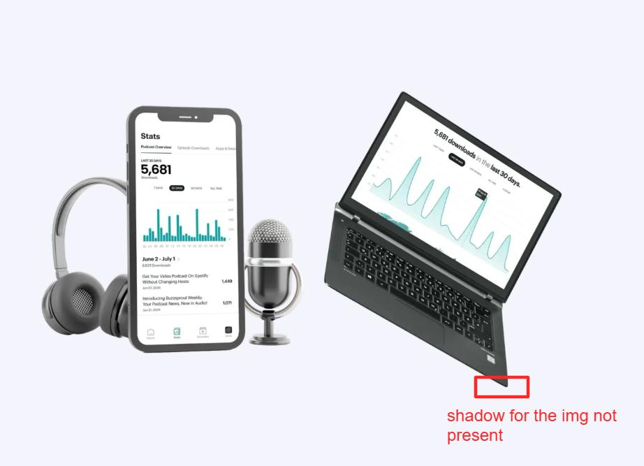

*Original QA evidence: missing analytics shadow annotation.*

*Final implementation evidence: final Podcast page treatment; analytics artwork follows the approved asset styling.*

---

## 9. Final QA Checklist

- [x] All 21 original QA findings reviewed
- [x] Approved design references checked for each affected section
- [x] Incorrect image and decorative-asset claims rechecked against available assets
- [x] Confirmed typography and visual differences corrected
- [x] Responsive clipping, overlap, and alignment issues closed
- [x] Later approved directions recorded for Ideas Lab and What We Do
- [x] Original annotated QA screenshots retained as evidence
- [x] Final implementation screenshots included as closure evidence

## 10. Final Status

**21 of 21 findings are closed. No QA item remains open.**

